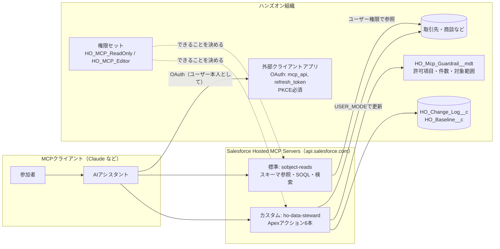
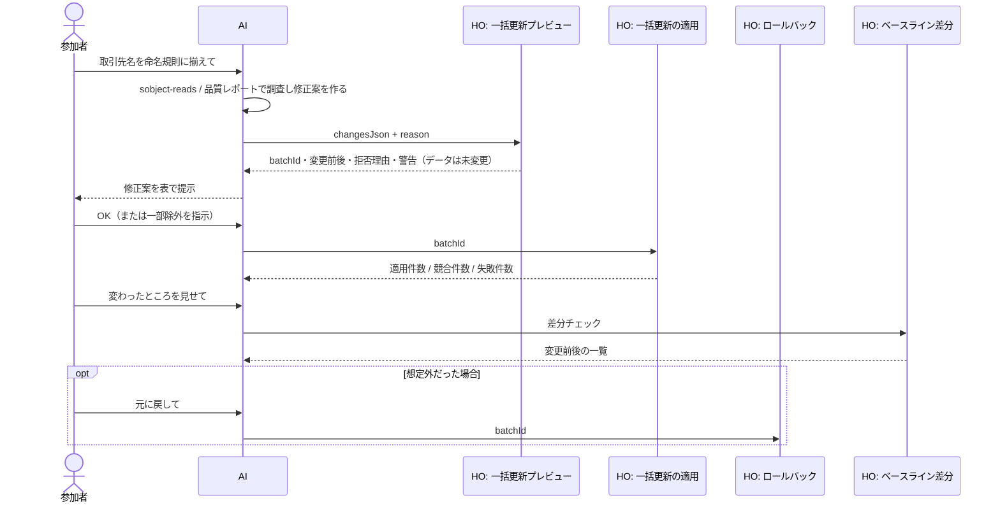

# MCP 構成案 — 「AIにまとめて更新させる」を安全に行う

## 1. 全体像

MCP の呼び出しは**接続したユーザー本人の権限**で実行されます。つまり「AIに何をさせてよいか」は、
新しい仕組みではなく **権限セット・項目レベルセキュリティ・共有設定**でそのまま制御できます。
その上で、プロンプトでは防げない「うっかり全件更新」を防ぐため、更新はカスタムツールに寄せています。

## 2. 使用する MCP サーバ

| フェーズ | サーバ | 理由 |
| --- | --- | --- |
| ① 調査・分析（シナリオA〜Cの前半、シナリオC全体） | 標準 `sobject-reads` | 参照のみ。スキーマ理解・SOQL・集計はこれで足りる |
| ② 補助（任意） | カスタム `ho-data-steward` の参照系2ツール | 品質レポート・ベースライン差分。SOQLを何度も組まなくても当たりを付けられる |
| ③ 一括更新（シナリオA・Bの後半） | カスタム `ho-data-steward` の更新系4ツール | プレビュー必須・監査ログ・ロールバック・件数上限 |
| 比較デモ（講師のみ） | 標準 `sobject-all` | 「作成・更新・削除が何でもできる」ことの怖さを見せる。参加者には渡さない |

> 標準サーバの URL 形式: `https://api.salesforce.com/platform/mcp/v1/platform/<サーバ名>`
> （Sandbox / スクラッチ組織は `/v1/sandbox/`）。カスタムサーバの URL はサーバの詳細ページからコピーします。

## 3. 組織側の設定手順

### 3-1. デプロイと権限

1. `./scripts/setup-org.ps1 -TargetOrg <alias>` でメタデータとデータを用意
2. MCP で接続するユーザーに権限セットを付与
   - 前半: `HO_MCP_ReadOnly`
   - 後半: `HO_MCP_Editor`（ハンズオンの中で**権限を追加する体験自体**を見せ場にする）
3. MCP 接続ユーザーのプロファイルは**「最低限のアクセス - Salesforce」**にする
   - 権限セットは権限を「足す」だけで、プロファイルの権限は打ち消せません。「標準ユーザー」のままだと
     `HO_MCP_ReadOnly` しか付けていなくても取引先を編集できてしまいます（テスト `readOnlyMcpUserCanAnalyzeButNotUpdate` で確認）
   - 3つの権限セットには、使う標準項目（商談の金額・取引先など）とカスタム項目の項目レベルセキュリティを含めてあります
   - 管理者で接続すると、権限セットに関係なく全データを参照・更新できてしまうため、ハンズオンでは使わない

### 3-2. 外部クライアントアプリケーション（External Client App）

Hosted MCP では従来の接続アプリケーションは使えず、外部クライアントアプリケーションが必要です。

| 設定 | 値 |
| --- | --- |
| OAuth を有効化 | ON |
| コールバック URL | Claude（claude.ai / Claude Desktop のカスタムコネクタ）: `https://claude.ai/api/mcp/auth_callback` ローカルブリッジ（mcp-remote など）: `http://localhost:8080/oauth/callback` |
| OAuth 範囲 | `mcp_api`（MCP サーバへのアクセス）、`refresh_token, offline_access` |
| フロー | 「名前付きユーザー用の JWT ベースのアクセストークンを発行」ON |
| セキュリティ | PKCE 必須 |

`api` スコープではなく `mcp_api` を使う点に注意してください。

### 3-3. MCP サーバの有効化とカスタムサーバの作成

1. 設定 → API カタログ → MCP サーバ → `sobject-reads` を開いて有効化
2. 「カスタムサーバ」タブ → 新規
   - 表示名: `HO Data Steward` / API 名: `ho_data_steward`
   - 説明: 「ハンズオン用データの品質調査と、プレビュー・承認・ロールバック付きの一括更新」
3. 「ツールを追加」→ 種別「Apex アクション」で以下6つを追加し、有効化

| ツール（Apexクラス） | 種別 | 必要な権限セット |
| --- | --- | --- |
| `HO_ToolDataQualityReport` | 参照 | ReadOnly / Editor |
| `HO_ToolCompareWithBaseline` | 参照 | ReadOnly / Editor |
| `HO_ToolPreviewBulkUpdate` | 更新なし（ログのみ書き込み） | Editor |
| `HO_ToolApplyBulkUpdate` | 更新 | Editor |
| `HO_ToolRollbackBulkUpdate` | 更新 | Editor |
| `HO_ToolMergeAccounts` | 既定は更新なし / dryRun=false で統合 | Editor（取引先の削除権限が必要） |

4. 詳細ページのサーバ URL をコピー

> メニュー名は 2026年9月時点の公開情報をもとにしています。リリースによって表記が変わる場合があります。

### 3-4. クライアントの接続

Claude（claude.ai / Claude Desktop）: 設定 → コネクタ → カスタムコネクタを追加 →
サーバ URL と外部クライアントアプリのコンシューマ鍵（OAuth クライアント ID）を入力 → Salesforce にログインして許可。
`sobject-reads` と `HO Data Steward` の2つを登録します。

## 4. 一括更新の流れ（シナリオA・Bの後半）

### ツール側で強制していること（プロンプトに頼らない安全策）

| リスク | 対策 | 実装箇所 |
| --- | --- | --- |
| 確認なしで更新される | プレビューでは更新しない。適用は batchId 必須。プレビューから60分で失効 | `HO_BulkUpdateService` |
| 想定外の項目を書き換える | 許可項目リスト（カスタムメタデータ）にない項目は拒否 | `HO_Mcp_Guardrail__mdt` |
| 全件更新してしまう | 1バッチの件数上限（取引先200件・商談100件など） | 同上 |
| 本物のデータに触る | `Workshop_Data_Only__c = true` なら `HO_Workshop_Data__c` のレコード以外は拒否 | 同上 |
| 権限以上のことをする | `AccessLevel.USER_MODE` でクエリ・更新（項目レベルセキュリティと共有設定を適用） | 全ツール |
| プレビュー後に誰かが同じレコードを更新 | 変更前の値が変わっていたらそのレコードは適用せず Conflict | `execute()` |
| 間違えた | 項目単位の変更ログからロールバック（適用後に別の変更が入った項目は上書きしない） | `HO_Change_Log__c` |
| 誰が何をなぜ変えたか分からない | バッチID・変更理由・作成者・変更前後を記録 | 同上 |
| 取引先の統合で別会社をまとめてしまう | 既定は dryRun。法人番号の差異などを返す。実行には理由が必須 | `HO_MergeService` |
| 標準ツールなど別の経路で変えられた | ベースラインとの差分で経路に関係なく検出 | `HO_BaselineService` |

## 5. 本番組織で運用する場合の考え方（まとめパート用）

1. **MCP 専用の権限セットを作り、プロファイルには付けない**。参照用と更新用を分け、更新用は期間限定で付与する
2. **標準の `sobject-all` はいきなり渡さない**。まず `sobject-reads`、更新はカスタムサーバで業務単位のツールに絞る
3. **ガードレールはコードではなくメタデータ**で管理し、許可範囲の変更をリリースレビューの対象にする
4. **「プレビュー → 人の承認 → 適用」をツールの仕様で強制**する（ツールの説明文だけに頼らない）
5. **変更ログ・項目履歴管理・イベントモニタリング**で、誰が・どのツールで・何を変えたかを追えるようにする
6. 統合・削除のように**元に戻せない操作は、人が画面で行う**運用も有力な選択肢
7. 本番ではまず Sandbox（`/v1/sandbox/`）で、同じ権限セットとガードレールのまま試す

## 6. AI に伝えておくとよいデータモデル上の注意

- `HO_失注理由詳細`（`HO_Loss_Reason_Detail__c`）はロングテキストのため、SOQL の WHERE で絞り込めません。
  「失注理由が空で詳細メモがあるもの」は、失注理由でだけ絞り込んで取得し、メモの有無は取得後に判定させます
  （品質レポートの `closedLostWithoutReason.inferableFromDetail` はこの件数を返します）
- 取引先の都道府県は標準の住所項目ではなくテキスト項目 `HO_Prefecture__c` です（州/国選択リストが有効な組織でも表記ゆれを再現するため）
- 担当営業は所有者ではなくテキスト項目 `HO_Sales_Rep__c`（商談・活動）です（Developer Edition はユーザー数が少ないため）

## 7. 未検証・要確認事項

- Developer Edition / Trailhead Playground で Hosted MCP Server と API カタログのカスタムサーバが使えるか（参加者の組織を用意する前に1組織で確認が必要）
- Apex アクションをカスタムサーバに登録した際のツール名・説明の表示（`@InvocableMethod` の label/description がそのまま使われる想定）

確認済み: ロック解除パッケージはインストール後スクリプトに対応していない（バージョン作成時にエラー）。
そのため、インストール後の権限セット付与とデータ生成は手動（準備画面のボタン）で行います。
